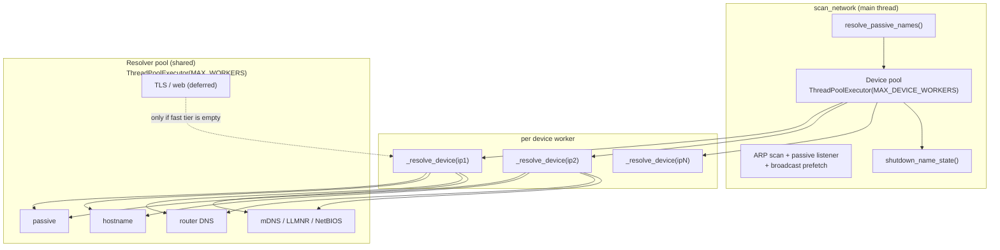
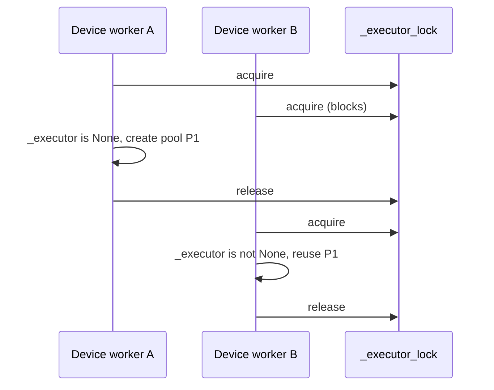
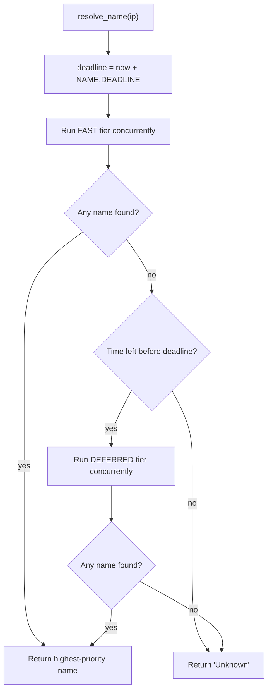
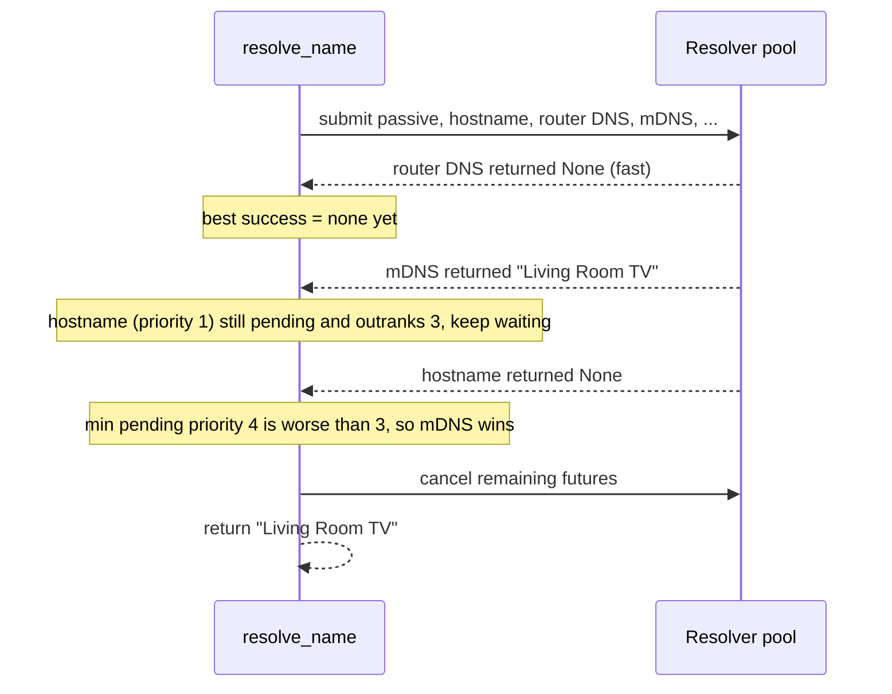

# Concurrency in lantern

This document explains how `lantern` runs work in parallel, how the
thread pools are wired together, and how the small amount of shared state is
protected. It also covers the threading primitives used here — locks,
semaphores, futures, and context variables — and the failure mode that led to
removing a semaphore that used to guard the network probes.

The short version: there are **two nested thread pools** (one per device, one
per name source), a **single shared lock** guarding the resolver pool, **no
semaphores**, and a **deadline plus priority rule** that decides which result
wins.

## Table of contents

- [Why concurrency at all](#why-concurrency-at-all)
- [The two pools](#the-two-pools)
- [Scan lifecycle](#scan-lifecycle)
- [The resolver pool and its lock](#the-resolver-pool-and-its-lock)
- [Resolving one device: priority, tiers, and the deadline](#resolving-one-device-priority-tiers-and-the-deadline)
- [Cancellation, draining, and why work can outlive a call](#cancellation-draining-and-why-work-can-outlive-a-call)
- [Threading primitives used here](#threading-primitives-used-here)
  - [Locks](#locks)
  - [Semaphores (and the one we removed)](#semaphores-and-the-one-we-removed)
  - [Futures and executors](#futures-and-executors)
  - [Context variables and logging](#context-variables-and-logging)
- [Sniffers and scapy threads](#sniffers-and-scapy-threads)
- [Terminal output and the spinner](#terminal-output-and-the-spinner)
- [Constants reference](#constants-reference)
- [Known limitations](#known-limitations)

## Why concurrency at all

Name resolution is a chain of network probes, each with its own timeout:

- reverse DNS (`hostname`),
- a PTR query to the router (`router DNS`),
- mDNS and LLMNR multicast queries,
- NetBIOS,
- SNMP `sysName`/`sysDescr`,
- SSDP/UPnP,
- a TLS handshake,
- an HTTP fetch for the page `<title>`,
- short-lived service banners (SSH, SMB, ...).

Run sequentially, a device that never answers costs the **sum** of every
timeout — roughly 20 seconds. Multiply that by every host on a `/24` and a scan
takes minutes. Run them concurrently and a device costs the **maximum** timeout,
not the sum. That is the entire reason for the pools below.

The trade-off is that threads are cheap to start but expensive to coordinate,
so the design tries to keep coordination to a minimum: one lock, no shared
mutable structures across devices, and a rule that lets a fast answer end the
work early.

## The two pools

There are two `ThreadPoolExecutor`s, and they form a parent/child relationship:

1. **Device pool** — created in `scan_network` (`main.py`) with
   `NAME.MAX_DEVICE_WORKERS` workers. It maps `_resolve_device` over every
   discovered host, so several devices are resolved at the same time.
2. **Resolver pool** — created lazily in `resolvers/name.py` with
   `NAME.MAX_WORKERS` workers. Each call to `resolve_name` submits that device's
   name sources to it, so one device's sources run at the same time.



Why is nesting safe? A **device worker blocks** inside `resolve_name` waiting on
its source futures, but a **resolver worker never waits on the device pool**.
The wait graph is one-directional (`device -> resolver`), so there is no cycle
and therefore no deadlock. This is the key property to preserve if you add
another pool later.

`ThreadPoolExecutor.map` returns results in the order of its input, so the
printed table keeps the host order even though completion order is arbitrary.

## Scan lifecycle

The passive listener, the scan-wide broadcast prefetch, and the active ARP
probe all start together and overlap. The listener and the prefetch are joined
before the device pool starts, and the device pool is bounded by
`NAME.DEADLINE` per device and the final drain.

```mermaid
sequenceDiagram
    participant Main as scan_network (main)
    participant Passive as Passive sniffer (thread)
    participant ARP as ARP srp
    participant Pre as prefetch
    participant Dev as Device pool
    participant Res as Resolver pool

    Main->>Passive: start_passive_scan()
    Main->>Pre: start_prefetch_broadcast()
    Note over Main,ARP: passive, broadcast prefetch,<br/>and active ARP run concurrently
    Main->>ARP: srp(ARP broadcast)
    ARP-->>Main: hosts
    Main->>Passive: finish_passive_scan() (join; stops early once quiet)
    Main->>Pre: finish_prefetch_broadcast() (join)
    Main->>Passive: resolve_passive_names()
    Note over Pre: mDNS browse and SSDP discovery — once for all hosts
    Note over Passive: passive SSDP descriptions, once the listener is joined
    Main->>Dev: map(_resolve_device, hosts)
    Dev->>Res: submit fast sources
    Res-->>Dev: highest-priority name
    Dev->>Res: submit deferred sources (only if needed)
    Res-->>Dev: name or None
    Main->>Res: shutdown_name_state() (drain)
    Main->>Main: print table, report elapsed
```

The **prefetch** step exists because mDNS browsing and SSDP discovery are
broadcast/multicast operations that answer for *every* host at once. Doing them
per device would repeat the same round-trips N times. Prefetch runs them once,
caches `IP -> name`, and the per-device sources then read from those caches
(`resolvers/ssdp.py`, `passive.py`, `resolvers/mdns.py`).

Prefetch is split into two parts by what it depends on:

- **Broadcast prefetch** (`prefetch_broadcast_names`) — mDNS browse and SSDP
  discovery plus description fetch. Neither depends on the ARP results nor on
  the passive cache, so `start_prefetch_broadcast()` launches them in a
  background thread *before* the ARP scan and they overlap the passive
  listening window instead of running after it. The mDNS and SSDP multicasts
  use different groups and sockets, so they run on two threads
  (`NAME.PREFETCH_WORKERS`) and finish in roughly the longer of the two.
- **Passive descriptions** (`resolve_passive_names`) — the SSDP locations the
  listener overheard. These are only known once the listener has been joined,
  so this runs after `finish_passive_scan`. Its per-device HTTP fetches are
  independent, so they run concurrently too (`PASSIVE.MAX_FETCH_WORKERS`),
  as do SSDP's (`SSDP.MAX_FETCH_WORKERS`).

`prefetch_scan_names()` remains the synchronous one-shot (broadcasts, then
passive descriptions) for callers that are not overlapping with the listener.

## The resolver pool and its lock

The resolver pool is a **lazy module-level singleton** in
`resolvers/name.py`:

```python
_executor = None
_executor_lock = threading.Lock()


def _get_executor():
    global _executor
    with _executor_lock:
        if _executor is None:
            _executor = concurrent.futures.ThreadPoolExecutor(
                max_workers=NAME.MAX_WORKERS,
                thread_name_prefix="name",
            )
        return _executor
```

`_executor_lock` is an ordinary **mutual-exclusion lock** (a mutex). It exists
because `_get_executor` can be called by several device workers simultaneously.
Without the lock, two threads could both observe `_executor is None`, both
construct a pool, and one pool would silently replace the other — leaking a
pool's threads. This is the classic *check-then-act* race:



Three rules keep the lock safe and cheap:

- **It is held only for the check and the assignment.** No network I/O, no
  `submit`, no blocking call happens while the lock is held. That keeps the
  critical section nanoseconds long, so the lock is effectively uncontended.
- **Every mutation of `_executor` goes through the lock.** `_get_executor`,
  `reset_name_state`, and `shutdown_name_state` all acquire it.
- **The lock is not re-entrant and is never acquired twice** by the same code
  path, so there is no self-deadlock.

`shutdown_name_state` deliberately swaps the global to `None` *inside* the lock
and then calls `executor.shutdown(...)` *outside* it:

```python
def shutdown_name_state():
    global _executor
    with _executor_lock:
        executor, _executor = _executor, None
    if executor is not None:
        executor.shutdown(wait=True, cancel_futures=True)
```

If `shutdown` were called while holding the lock, a worker calling
`_get_executor` would block until the drain finished — harmless but pointless
contention, and a habit that invites deadlocks as code grows. Releasing first
means the lock is only ever held for bookkeeping.

> **The GIL is not a substitute for a lock.** CPython's Global Interpreter Lock
> makes individual bytecode operations atomic, but `if _executor is None:` and
> the following assignment are multiple bytecodes, and a thread switch can land
> between them. The GIL guarantees no memory corruption, not correct
> check-then-act logic.

## Resolving one device: priority, tiers, and the deadline

`resolve_name` is the heart of the design. It runs in a **device worker**
thread and coordinates the **resolver workers**.

### Priority

`NAME_SOURCES` is an ordered tuple. Index is priority: `passive` is 0 (best),
`service banner` is 11 (worst). The winner is always the *highest-priority*
source that returned a non-empty name, regardless of which finished first. If
`mDNS` and `web title` both answer, `mDNS` wins because it is earlier in the
tuple.

### Tiers

Sources are split into two tiers:

- **Fast tier** — everything except `NAME.DEFERRED_SOURCES`.
- **Deferred tier** — `TLS certificate`, `web title`, and `service banner`, the
  slowest and lowest-yield probes.

The deferred tier is submitted **only if the fast tier produced no name**. A
device named by passive/mDNS/SSDP/hostname therefore never opens a TLS
connection, fetches a web page, or probes service banners, which removes the
bulk of wasted work and end-of-scan noise.



### Early exit

`_run_sources` submits a tier, then waits for **first completion** in a loop:

```python
done, pending = concurrent.futures.wait(
    pending,
    timeout=remaining,
    return_when=concurrent.futures.FIRST_COMPLETED,
)
```

After each batch of completions it asks a single question:

```python
def _highest_priority_success(successes, futures, pending):
    if not successes:
        return None
    best_priority = min(successes)
    pending_priorities = [futures[future][0] for future in pending]
    if pending_priorities and min(pending_priorities) < best_priority:
        return None
    return successes[best_priority]
```

In words: **return the best success now only if no still-running source is
higher priority.** If a better source is still in flight, keep waiting. This is
what makes the concurrency both fast and correct — a fast low-priority answer
never preempts a slow high-priority one, but once the highest-priority pending
source has resolved, the rest are cancelled.

**Opt-in full matrix.** Setting `LANTERN_FULL_MATRIX=1` (read as
`NAME.FULL_MATRIX`) skips that early-exit check: `_run_sources` keeps waiting
for every source in the tier, cancellations never happen, and `responded`
records the complete set of protocols that answered. The tier's priority rule
still decides the winning name, and the shared `DEADLINE` still caps the wait —
so the mode trades scan time for matrix coverage, not correctness. It is off by
default, and it does not change the tier gating: the deferred tier still only
runs when the fast tier finds no name.



### The deadline

`NAME.DEADLINE` is an absolute wall-clock budget per device, shared across both
tiers. Every `wait` call uses `timeout = deadline - now`, so the loop can never
exceed the budget. When the deadline is reached, the best success collected so
far is returned, or `Unknown` if there was none. A tier is never even submitted
if the deadline has already passed.

## Cancellation, draining, and why work can outlive a call

This is the subtlest part of the design, and the source of a real bug we hit.

`Future.cancel()` has an important limitation:

- If the task is still **queued** (a worker has not picked it up), `cancel()`
  marks it cancelled and it never runs.
- If the task is **already running**, `cancel()` returns `False` and the thread
  keeps going. Python cannot forcibly kill a thread.

So when `resolve_name` finds a winner and cancels the rest, the queued sources
stop, but the already-running ones keep going until their own timeouts expire.
`shutdown_name_state()` exists to **drain** those stragglers before the scan
reports:

```python
executor.shutdown(wait=True, cancel_futures=True)
```

`wait=True` blocks until every running task finishes; `cancel_futures=True`
discards anything still queued. Without this drain, lookups continue to run —
and log — *after* the results table is printed, which is exactly what the
earlier logs showed.

> **Rule of thumb:** if you start a background task, decide who waits for it.
> Here, the scan waits at the end via `shutdown_name_state`. Nothing is allowed
> to outlive the scan.

## Threading primitives used here

### Locks

`threading.Lock` provides **mutual exclusion**: at most one thread holds it at a
time; others block in `acquire()` until it is released. The `with lock:` form
releases it even if an exception is raised.

In this codebase there are exactly two locks: the resolver-pool singleton
(`_executor`) and the per-scan metadata store (`metadata._lock`, see below).
Per-device state (`successes`, `futures`, `pending`) is local to the
device worker's stack, and the prefetch caches are written before the device
pool starts and then only read.

The **metadata store** (`metadata.py`) is the one piece of shared state that
*is* written while the device pool runs: resolver workers record facts (model,
OS, serial, ...) concurrently, and `scan_network` reads them back only after
`shutdown_name_state` drains the pool. Its `_lock` guards the `_facts` dict and
is held only for the dictionary operations — no network I/O runs under it — and
`record` sanitizes values before storing so a fact can never reach the report
unsanitized. Facts are first-wins per key, so a later response cannot overwrite
an earlier one.

### Semaphores (and the one we removed)

A `threading.Semaphore(n)` is a counter that permits up to `n` threads to
proceed; `acquire()` decrements and blocks at zero, `release()` increments. It
is used to **limit concurrency**, not to protect data.

An earlier revision used a semaphore with `PROBE_LIMIT = 1` to serialize all
scapy-based sources, on the theory that concurrent sniffers might interfere:

```python
_probe_semaphore = threading.Semaphore(NAME.PROBE_LIMIT)  # removed


def _run_source(source, resolver, ip_address):
    if source in NAME.PACKET_PROBES:
        with _probe_semaphore:
            return resolver(ip_address)
    return resolver(ip_address)
```

It caused three problems:

1. **Starvation.** Every device's packet probes queued on one token. Devices hit
   `NAME.DEADLINE` while their probes were still waiting, so names that would
   have resolved fell through to `Unknown`.
2. **An uncancellable backlog.** A worker blocked on `acquire()` is *already
   running*, so `Future.cancel()` could not stop it. Cancelled devices' probes
   kept draining one by one long after their device was reported.
3. **No real benefit.** Each sniffer and each `sr1` call uses its own socket and
   filters replies by responder IP, so they do not actually need serializing.

The lesson: **a semaphore that blocks a pool worker turns concurrency into a
queue, and a queue of uncancellable tasks is a backlog.** The semaphore was
removed and the sources now run independently. If you ever do need to cap a
shared resource, prefer limiting what you *submit* over blocking inside a
worker.

### Futures and executors

`ThreadPoolExecutor` manages a set of worker threads and a queue of submitted
callables. `submit()` returns a `Future`, a placeholder for a result that may
not exist yet:

| Operation | Meaning |
| --- | --- |
| `future.result()` | Block for the value, re-raising any exception. |
| `future.cancel()` | Cancel only if not yet running; returns success. |
| `future.done()` | True once finished, cancelled, or raised. |
| `concurrent.futures.wait(fs, timeout, FIRST_COMPLETED)` | Block until any future in `fs` finishes, returning `(done, not_done)`. |
| `executor.shutdown(wait, cancel_futures)` | Stop accepting work; optionally cancel queued work and optionally wait. |

`resolve_name` uses `wait(..., FIRST_COMPLETED)` so it can react to the first
answer instead of blocking on a fixed-order `result()` call. Exceptions from
resolvers are caught per-future and logged, so one failing source never aborts
the chain.

### Context variables and logging

Loguru's `logger.contextualize(device=...)` is built on `contextvars.ContextVar`
(actually a `ContextVar` holding the logger's `extra`). A context variable is
**thread-local-ish**: each thread has its own context, and a value set in one
thread is not visible in another.

The device worker sets the context around `resolve_name`, but the resolver
functions execute on *different* threads in the pool, which do not inherit it.
That is why the earlier logs showed a `-` in the device column for pooled
lookups. The fix is to re-apply the context inside the worker function:

```python
def _run_source(source, resolver, ip_address, device):
    with logger.contextualize(device=device or "-"):
        return resolver(ip_address)
```

The device label is passed explicitly into the pooled call rather than relying
on implicit propagation. Note this is *not* the same as a lock: context
variables avoid sharing, whereas a lock protects sharing.

## Sniffers and scapy threads

Not all concurrency here comes from the two pools. Several resolvers use
scapy's `AsyncSniffer`, which runs its capture loop in a background thread:

- the **passive listener** (`passive.py`) sniffs while the ARP scan runs,
  harvesting ARP, DHCP, mDNS, SSDP, and LLMNR chatter. The window is adaptive:
  it stops once `PASSIVE.QUIET_PERIOD` seconds pass with no new announcement
  (after a `PASSIVE.MIN_WINDOW` floor), or at the `PASSIVE.TIMEOUT` ceiling on
  a network that keeps talking. The ARP burst itself is chatter the listener
  sees, so a quiet LAN closes the window seconds after the scan;
- **mDNS** (`resolvers/mdns.py`) starts a sniffer, then sends its multicast
  query from the sniffer's `started_callback`, and joins when the timeout
  expires;
- **LLMNR** (`resolvers/llmnr.py`) does the same;
- **SSDP** (`resolvers/ssdp.py`) does the same for its M-SEARCH.

These are self-contained: each sniffer has its own capture handle and the
parsing code filters packets by the expected source IP or query name. Because
the passive listener is joined (`finish_passive_scan`) before the device pool
starts, it does not overlap with the resolver probes. However, the listener
*does* overlap the broadcast prefetch's mDNS/SSDP sniffers, which is intended
(and largely redundant — the listener also records the responses the prefetch
elicits).

`scapy`'s `srp` (the ARP scan) and `sr1` (router DNS, NetBIOS) also use their
own sockets and, internally, a sender thread. They are called from resolver
workers and, as noted, are not serialized.

## Terminal output and the spinner

The passive listener shows a `yaspin` spinner while it waits, and the whole scan
logs through `loguru`. The two write to the same terminal from different
threads, which mangles output by default: yaspin redraws its frame in place with
a carriage return and no newline, so a record written straight to `stderr`
shares the frame's line, and the next frame redraws over it. The prefetch
threads exposed this, because they log *during* the listening window.

`logger.py` owns a `_SpinnerSink` that the passive listener registers its
spinner with (`attach_spinner`) for the duration of the animation. While a
spinner is attached, every record is routed through `Yaspin.write`, which clears
the frame, prints the record on its own line, and lets the next frame redraw
below it. With no spinner attached the sink writes to `stderr` exactly as
before.

Three details make this safe:

- The spinner and the logger share one stream (`stderr`; the results table
  stays on `stdout`), so clearing the frame actually clears the right line.
- `Yaspin.write` and the spinner thread both take yaspin's own stream lock,
  and loguru serialises calls into the sink, so a record never splits a frame.
- The listener stops the spinner *before* detaching it, so a log racing the
  teardown is still drawn above the frame rather than interleaved with it.

This is coordination, not a lock in this codebase's sense: the sink holds no
shared mutable state beyond the current spinner reference, and no resolver
touches it.

## Constants reference

All tuning lives in `constants.py`:

| Constant | Value | Meaning |
| --- | --- | --- |
| `NAME.DEADLINE` | `10.0` | Total seconds per device across both tiers. |
| `NAME.MAX_DEVICE_WORKERS` | `4` | Devices resolved in parallel. |
| `NAME.MAX_WORKERS` | `64` | Shared resolver-pool size. |
| `NAME.DEFERRED_SOURCES` | `{"TLS certificate", "web title", "service banner"}` | Slow sources tried only if the fast tier is empty. |
| `NAME.PREFETCH_WORKERS` | `2` | Threads for the scan-wide broadcast prefetch (mDNS vs SSDP). |
| `PASSIVE.TIMEOUT` | `30.0` | Ceiling on the passive listening window. |
| `PASSIVE.QUIET_PERIOD` | `3.0` | Silence after which the listener stops early. |
| `PASSIVE.MIN_WINDOW` | `5.0` | Minimum listening time before early stop is allowed. |
| `PASSIVE.POLL_INTERVAL` | `0.25` | How often the join loop checks for silence. |
| `PASSIVE.MAX_FETCH_WORKERS` | `8` | Concurrent passively-learned SSDP description fetches. |
| `SSDP.MAX_FETCH_WORKERS` | `8` | Concurrent SSDP description fetches during prefetch. |

Sizing intuition: with `MAX_DEVICE_WORKERS = 4` and twelve sources, at most ~48
tasks are live at once, so `MAX_WORKERS = 64` means a device's whole chain can
start without queuing behind another device. If you add sources or raise the
device worker count, revisit `MAX_WORKERS`.

Every `NAME.*` and `PASSIVE.*` value in the table is environment-overridable
(`LANTERN_NAME_*`, `LANTERN_PASSIVE_*`, plus `LANTERN_SSDP_MAX_FETCH_WORKERS`).
Values are read once at import; a malformed or below-minimum value falls back to
the default rather than raising. See [Configuration](../README.md#configuration)
for the full list.

## Known limitations

- **Early exit leaves running fast-tier probes to finish.** They cannot be
  cancelled, so the end-of-scan drain may wait a few seconds. The deferred tier
  is never started for an already-named device, which bounds the waste.
- **Theoretical multicast cross-talk.** Concurrent sniffers on UDP/5353 and
  UDP/1900 could see each other's packets; every resolver filters by responder
  IP, and the scan-scoped prefetch removes most of the overlap. The broadcast
  prefetch now runs its sniffers at the same time as the passive listener.
- **The adaptive passive window trades coverage for latency.** Stopping after a
  quiet period can miss a device that would have announced only after several
  seconds of silence. `PASSIVE.QUIET_PERIOD` (and `MIN_WINDOW`) is the dial;
  raising it approaches the old fixed-window behavior.
- **A hard `DEADLINE` can cut off a slow-but-valid answer.** It is a deliberate
  latency/coverage trade-off, tuned by the constant above.

If you change the concurrency model, keep these invariants:

1. No cycles in the wait graph between pools.
2. Shared mutable state is guarded by a lock; everything else is thread-local.
3. Every task started is either cancelled, drained, or intentionally detached.
4. The highest-priority success wins, not the first to finish.
